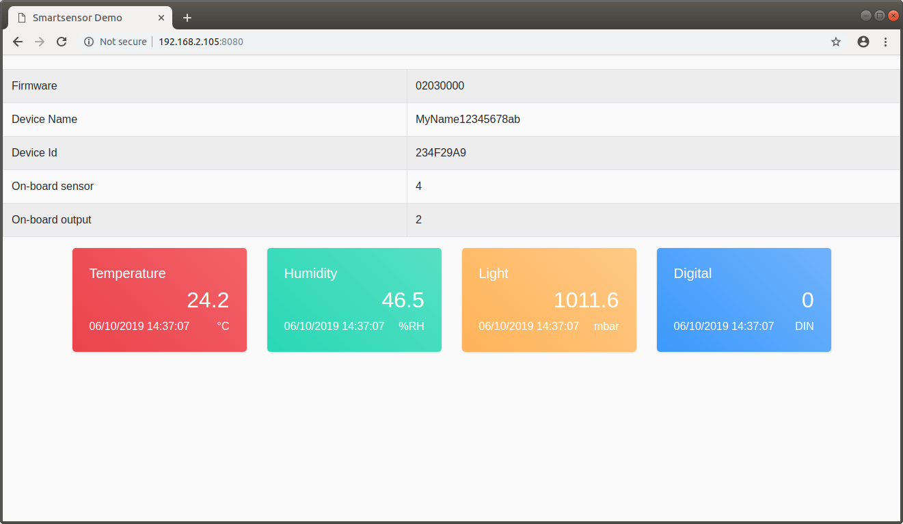

## Prerequites

Install Python3 Package manager:
```
sudo apt-get install python3-pip
```


Install python packages:
```
sudo pip3 install flask flask_socketio
```

## Configuration
The default configuration for the demo `demo.py` is `/dev/i2c-3`, `interrupt pin: 16` :

`bus = BusI2C(3, SMARTSENSOR_I2C_ADDR)

ss = Smartsensor(bus, 16, example_callback)`

## Run demo

Give executable permission:
```
cd examples/web_demo
sudo chmod a+x run_demo.sh
```

Run demo and start server:
```
./run_demo.sh
```

The demo is now accessible at `http://localhost:8080`

_Hit F5 to refresh a couple times if page doesn't start right up_

